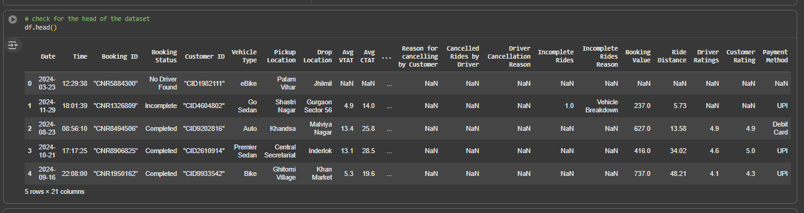
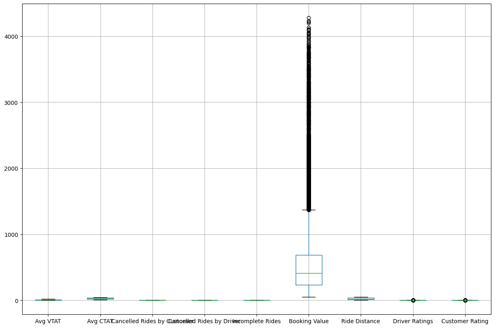
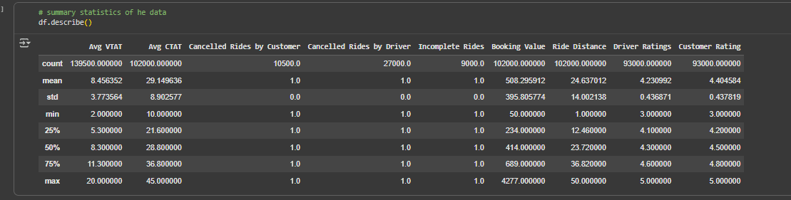

# Uber-Sales-Analytics
This comprehensive analysis contains detailed ride-sharing data from Uber operations for the year 2024, providing rich insights into booking patterns, vehicle performance, revenue streams, cancellation behaviors, and customer satisfaction metrics.

The goal of this analysis is to uncover insights from the data and make valuable recommendations for the company.

### Objectives of the Analysis
1. Data Importation.
2. Data exploration.
3. Data cleaning.
4. Booking patterns.
5. Customer ratings.
6. Distribution of vehicle types.


## Data and Library Importation

 ```python
# importing the necessary libraries
import pandas as pd
import numpy as np
import matplotlib.pyplot as plt
import seaborn as sns
import warnings
warnings.filterwarnings('ignore')
```

```python
# importing the dataset
df = pd.read_csv("/content/drive/MyDrive/Colab Notebooks/UBER ANALYTICS/ncr_ride_bookings.csv")
```


## Data Exploration
### Data Snapshot


Before the commencement of the analysis, the data was examined by checking the shape of the data, the data types, and the missing values. The results of 
the exploration revealed that the dataset has about 150,000 rows, whereas certain fields like `Avg VTAT`	(10500), `Avg CTAT`	(48000), `Cancelled Rides by Customer`	(139500), `Reason for cancelling by Customer`	(139500), `Cancelled Rides by Driver`	(123000), `Driver Cancellation Reason`	(123000), `Incomplete Rides`	(141000), `Incomplete Rides Reason`	(141000), `Booking Value`	(48000), `Ride Distance`	(48000), `Driver Ratings`	(57000), `Customer Rating`	(57000), `Payment Method`	(48000) have missing entries.


## Checks for outliers


It can be observed that the booking value had so much outliers, but will be left since we're not building a predictive model and won't impact our analysis.

## Summary Statistics



## Data Preprocessing


The data had to be adequately prepared before moving ahead with our analysis. Therefore, I
* Removed data fields with too many missing values outrightly:
  
```python
# Dropping off data fields with so much missing values
df.drop(["Cancelled Rides by Customer","Reason for cancelling by Customer","Cancelled Rides by Driver","Driver Cancellation Reason","Incomplete Rides","Incomplete Rides Reason"],axis=1,inplace=True)
```


* Replaced missing values in other numerical fields with the median:

```python
# replacing the missing avg vtat with the median
df['Avg VTAT'].fillna(df['Avg VTAT'].median(),inplace=True)


# replacing the missing avg ctat with the median
df['Avg CTAT'].fillna(df['Avg CTAT'].median(),inplace=True)

# replacing the missing booking value with the median
df['Booking Value'].fillna(df['Booking Value'].median(),inplace=True)

# replacing the missing Customer rating with the median
df['Customer Rating'].fillna(df['Customer Rating'].median(),inplace=True)

# replacing the missing Driver Ratings with the median
df['Driver Ratings'].fillna(df['Driver Ratings'].median(),inplace=True)

# replacing the missing Rides Distance with the median
df['Ride Distance'].fillna(df['Ride Distance'].median(),inplace=True)
```

* Replaced missing values in the rest of the categorical fields with the mode

```python
# replacing the missing payment method with the mode
df['Payment Method'] = df['Payment Method'].fillna(df['Payment Method'].mode()[0])
```

## Converting the Date Field into a Proper Data Type

```python
# converting the date column to a proper date data
df['Date'] = pd.to_datetime(df['Date'])

# extract day from date
df['Day'] = df['Date'].dt.day
# extracting month from date
df['Month'] = df['Date'].dt.month
# extract year from date
df['Year'] = df['Date'].dt.year
```
